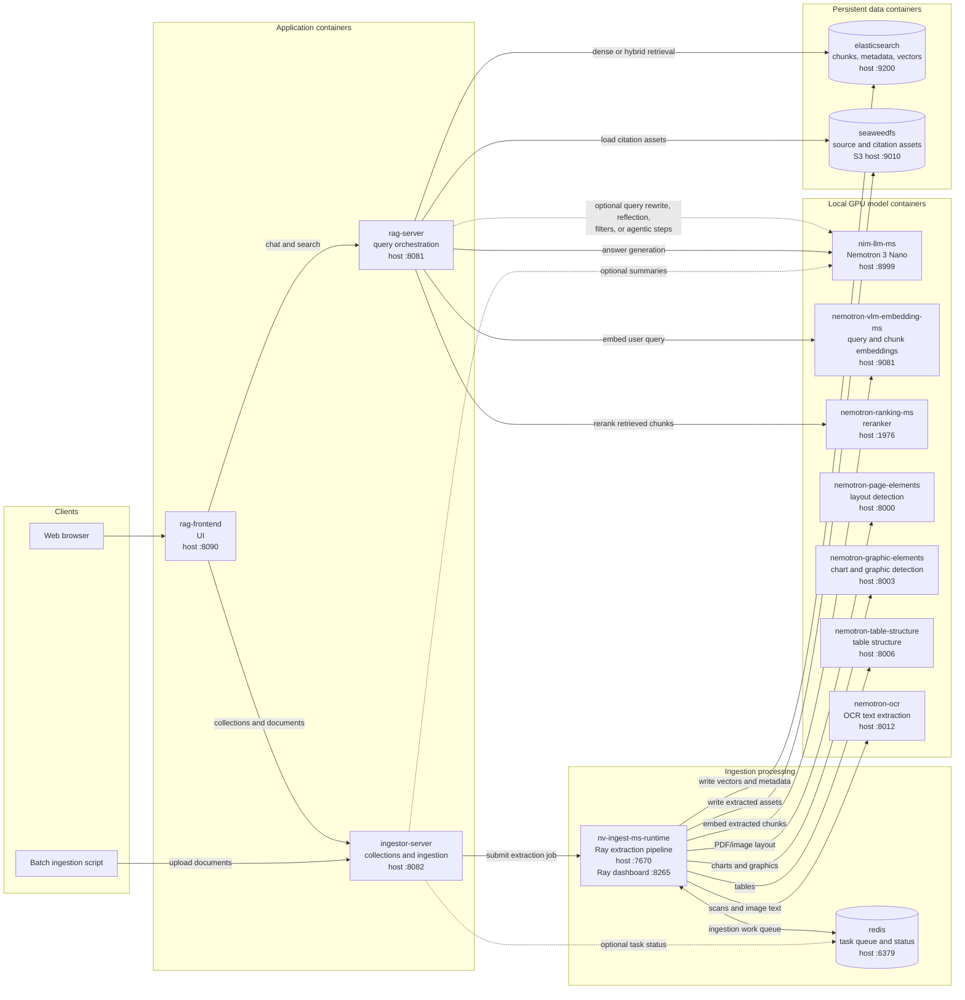
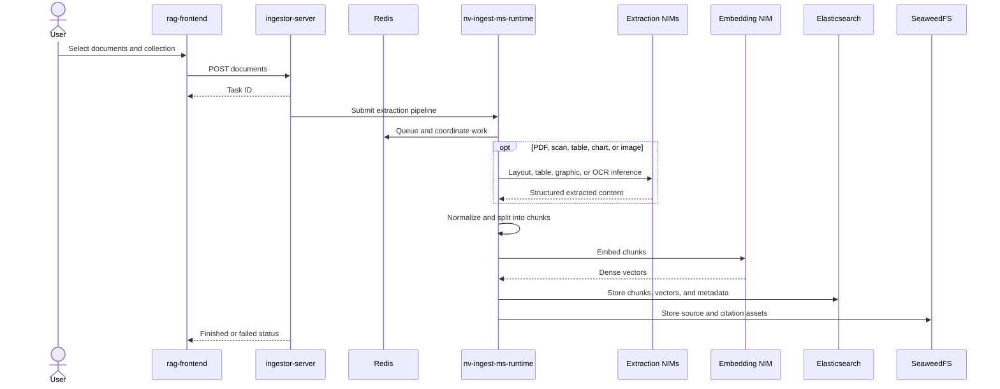
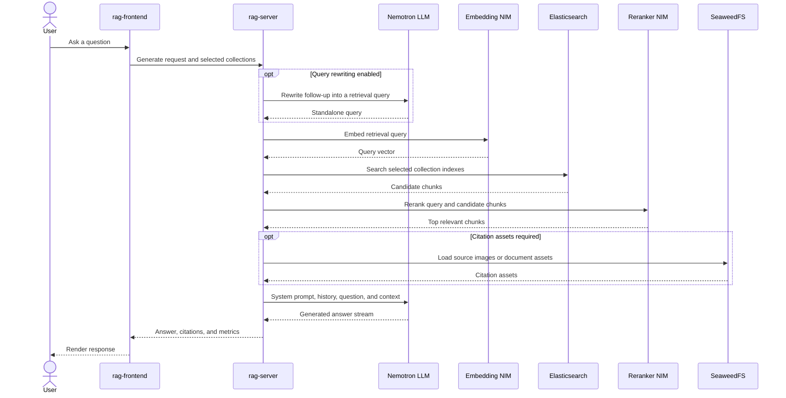

# DGX Spark Container Pipeline

All containers communicate over the Docker network `nvidia-rag`. Host ports
are shown only where a user or administrator can access a service directly.

## Document Ingestion

CSV and XLSX files take a compatibility path in `ingestor-server`: their cells
are rendered as Markdown tables first, while their original filenames are
preserved. NV-Ingest then handles that Markdown as ordinary text.

## Question Answering

## Container Roles

| Container | Main role |
|---|---|
| `rag-frontend` | Browser interface for chat, collections, and uploads |
| `rag-server` | Retrieval, reranking, prompt construction, and answer generation |
| `ingestor-server` | Collection APIs, upload validation, task orchestration, and status |
| `nv-ingest-ms-runtime` | Ray-based extraction, splitting, embedding, storage, and vector upload |
| `redis` | NV-Ingest work queue and optional asynchronous task/status backend |
| `elasticsearch` | Persistent document chunks, metadata, and vectors |
| `seaweedfs` | S3-compatible storage for source and citation assets |
| `nim-llm-ms` | Local answer generation and optional LLM-assisted pipeline stages |
| `nemotron-vlm-embedding-ms` | Embeddings for both ingested chunks and user queries |
| `nemotron-ranking-ms` | Relevance reranking after vector retrieval |
| Extraction NIMs | Page layout, graphics, table structure, and OCR processing |
